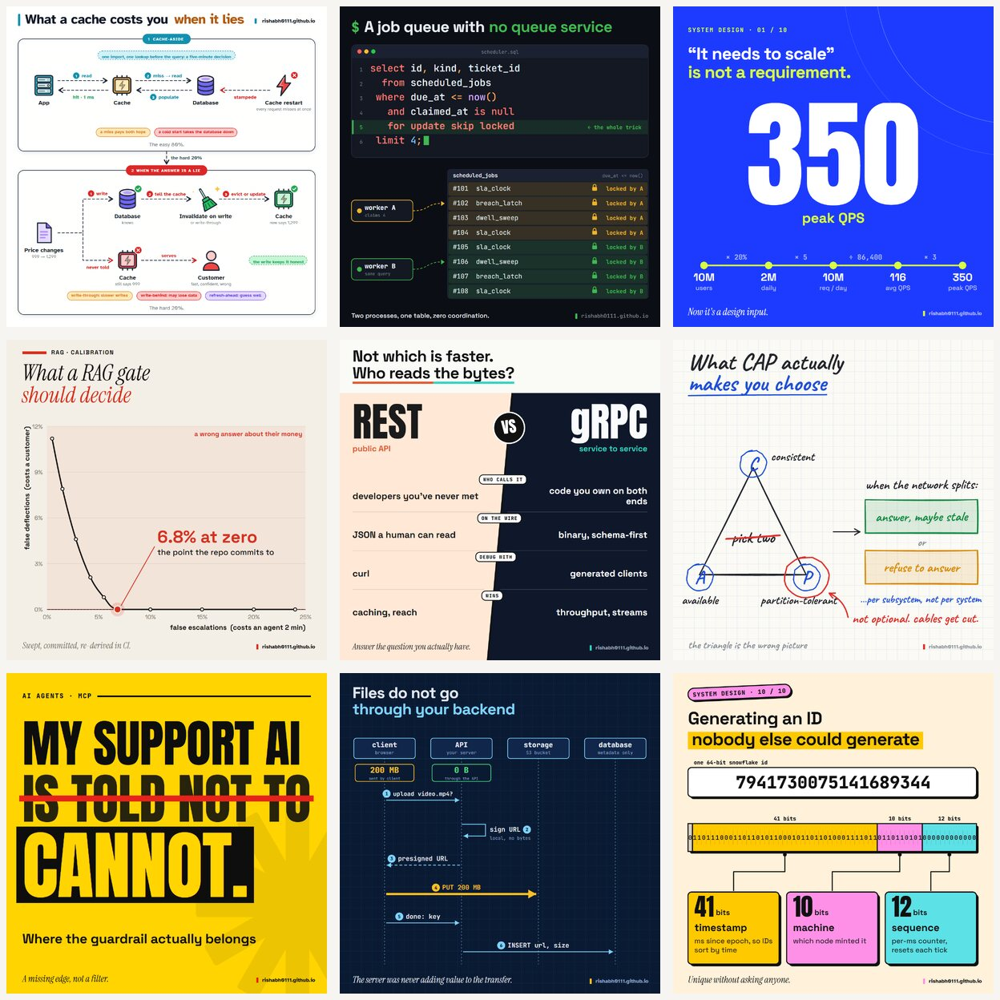

# cover-kit

Animated GIF covers for technical posts, rendered from a JSON spec.

Write a `cover.json` describing one idea from your post — a query, a number, a
race, an ID taken apart — pick one of nine styles, and get a 1200×1200,
7-second looping GIF. Built for LinkedIn image posts, but the output is a plain
GIF, so it works anywhere a square animated image does.



Open [`styles/gallery.html`](styles/gallery.html) in a browser to see every
style animating.

## Why

A moving image stands out in a feed of static ones, and a cover that shows
*one comprehensible idea* earns the click better than a headline or a full
architecture diagram. Covers that all share one template teach followers to
skip them, so the kit has nine styles with different grounds, and a linter
that stops you posting the same shape twice in a row.

## Requirements

- Node 22.12+ and npm (for [puppeteer](https://pptr.dev), which brings its own Chromium)
- `ffmpeg` on your `PATH`
- `bash` (macOS/Linux, or Git Bash on Windows)
- ImageMagick (`magick`) — only for `peek.sh`

```sh
git clone https://github.com/rishabh0111/cover-kit.git
cd cover-kit
npm install
./build-covers.sh --samples terminal     # renders styles/samples/terminal/cover.gif
```

## Quick start

1. Pick a style (see [Choosing a style](#choosing-a-style)).
2. Copy its sample spec into a folder of your own:
   ```sh
   mkdir -p covers/2026-10-01-my-post
   cp styles/samples/bignumber/cover.json covers/2026-10-01-my-post/
   ```
3. Edit the spec. Take every value from your post; the samples are examples,
   not data. Set `"brand"` to your site or handle, or delete it for no mark.
4. Iterate fast with a six-frame contact sheet, then build the GIF:
   ```sh
   ./peek.sh covers/2026-10-01-my-post        # -> peek.png beside the spec
   ./build-covers.sh covers/2026-10-01-my-post # -> cover.gif beside the spec
   ```

If the build prints `OVERLAPS:`, the page found text on text (or text off the
canvas). Fix the spec — shorter labels or a looser layout — never the font size
to squeeze it in.

`covers/` is just the default location (override with `COVERS_DIR` or pass any
path); keep your specs in this repo or anywhere else.

## Choosing a style

| Style | Ground | Use when the post… | Word budget |
|---|---|---|---|
| `flow` | white | has a mechanism with several moving parts | dense by design |
| `terminal` | near-black | turns on one query, config, snippet or printed output | ≤ 10 code lines |
| `bignumber` | electric blue | is one number: a measurement, an estimate, a before → after | 1 number + ≤ 6 words |
| `chart` | cream paper | is a trade-off curve, sweep or operating point | title + 2 axis labels |
| `versus` | split, slanted | compares two options, neither wrong | ≤ 5 rows × ≤ 5 words |
| `sketch` | whiteboard | is a mental model, or redraws a picture people learned wrong | ≤ 6 labels |
| `poster` | yellow | states an opinion, rule or myth-bust | ≤ 8 words |
| `sequence` | navy blueprint | depends on order: requests, retries, races, handshakes | ≤ 7 messages |
| `anatomy` | cream, neo-brutalist | takes one artefact apart: an ID, a token, a URL | ≤ 4 parts |

The spec's `"style"` picks the template. Each template in `styles/` documents
its own keys in its header comment, and `styles/samples/<style>/cover.json` is a
working spec to copy. `flow` is the densest; its vocabulary is
[below](#the-flow-style). [`STYLES.md`](STYLES.md) has the decision order, the
motion each style runs, and the rotation rules.

## Writing a good cover

**It is a hook, not a headline.** Open a curiosity gap and leave it open. A
finding stated as a complete sentence delivers the payload and removes the
reason to click. Keep the title stating the topic plainly; keep the payoff in
the post.

**Show one idea, not the architecture.** Pick the single mechanism the post
turns on and draw only that. If a junior engineer can't follow it in a few
seconds at thumbnail size, it's too much.

**Text-light.** Labels are one to three plain words. "Queue job fails" beats
"enqueue 5xx".

**Frame 0 is a finished composition.** If a GIF doesn't animate for someone,
the feed shows the first frame, so every template renders its final state
there, then starts moving within half a second.

For a second opinion, [`JUDGE.md`](JUDGE.md) is a review prompt you can give
any vision-capable AI agent (or follow yourself as a checklist).
[`STYLE.md`](STYLE.md) is the measured rubric behind the `flow` style.

## Rotation

Name each post's folder `YYYY-MM-DD-<slug>` and the linter reads your calendar:

```sh
node check-rotation.js                    # every covers/**/YYYY-MM-DD-*/cover.json, in date order
node check-rotation.js --plan             # overlay covers/rotation.json: planned styles not drawn yet
node check-rotation.js --plan --feed      # also write styles/feed.js for the gallery's feed view
```

- **hard** (exit 1): the same style as either of the two posts before it
- **soft**: the same ground tone as the post before
- **soft**: `flow` more than once in any four posts

## The `flow` style

`flow` (`bbg.html`) draws cards of icon nodes joined by labelled, animated
edges — the system-infographic look. Start from
[`cover.example.json`](cover.example.json).

- `cards[]` — `id`, `n`, `label`, `color`, `h`, optional `span` (0.5 puts two
  cards side by side), `caption`, `chips[]`, `notes[]`, `groups[]`, `flow[]`
  (edge indexes the packet walks, in order).
- `nodes[]` — `id`, `icon` or `value` (a big number in a box), `label`, `sub`,
  `tone`, `x`, `y` (fractions 0–1 of the card's inner area), optional `badge`
  (`x` / `check`) and `hero` (sparkles).
- `edges[]` — `from`, `to`, `label`, `n` (numbered badge), `route` (`h`, `v`,
  `hvh` with `xm`, `vhv`), `side` (preferred label side), `offset`, `fail`.
- `links[]` — a dashed connector between cards; `toPill: true` for an elbow
  into the next card's pill; `route: "side"` for a loop-back up the right
  margin between two node ids.
- Top level: `title`, `titleAccent`, `brand`, `theme`, `iconSize` (88 default;
  74–80 for three stacked lanes), `cardGap`, `loopFill` (0.9: the last 10% of
  the loop idles so frame 0 has no half-finished hit).

Edge labels place themselves: each tries a few spots and keeps the first that
touches no text, icon or line already on the card.

Icons (`icons-color.js`): client, user, team, server, lb, db, table, queue,
cache, box, lock, key, token, idcard, shield, check, x, bell, broom, clock,
hourglass, retry, mail, phone, webhook, doc, search, robot, gear, cloud,
globe, split, bolt, chart, wallet, scale, star, eye, crash.

## How it works

Each template is an HTML page that draws the cover as SVG from `window.SPEC`.
`render.js` opens it in headless Chrome, waits for fonts, reads the page's
overlap report, then calls `setFrame(i, n)` for each frame and screenshots it.
Every frame is a pure function of `t = i / n`, so renders are reproducible and
the loop closes seamlessly. `build-covers.sh` turns the frames into a GIF with
an ffmpeg palette pass (128 colours, Bayer dither).

Defaults: 1200 × 1200, 140 frames at 20 fps (`FRAMES=90 ./build-covers.sh …`
for a shorter loop). Most covers land between 150 KB and 1.5 MB. The layouts
are tuned for a square; `width`/`height` in a spec change the canvas, but check
the result.

## Adding a style

Copy a template in `styles/` and keep the page contract: set `window.setFrame`,
build inside `CS.run(...)` from `styles/base.js` (it waits for fonts, runs frame
0, records overlaps and sets `__ready`), draw the brand with `CS.brand`, and
mark decorative text `class="free"` to exempt it from the overlap check. Add a
sample under `styles/samples/<name>/` and a row in `STYLES.md`.

## License

Code: [MIT](LICENSE). Fonts in [`fonts/`](fonts) are under the SIL Open Font
License 1.1 ([`fonts/OFL.txt`](fonts/OFL.txt)); each file carries its own
copyright: Atkinson Hyperlegible, Anton, JetBrains Mono, Space Grotesk, Caveat
and Instrument Serif.

The `flow` style's structure was studied from ByteByteGo's system infographics
([`STYLE.md`](STYLE.md) records what was measured); the palette, icons and code
are original. This project isn't affiliated with ByteByteGo or LinkedIn.
